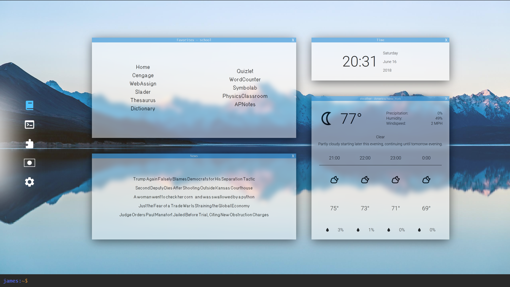

### startpage

Startpage/ newtab page with favorites, weather, and news.

Look inspired by Microsoft's fluid design, thanks bill.



Categories for favorites on the left. Use the command line on the bottom to Google search and add/remove/update favorites:

```
s [insert query here sans brackets]
add category linkname url
rename category oldname newname
relink category name newUrl
rm category name
```

The default categories are school, tech, misc, nip, and settings.

If you want to use this then you need to get API keys from [darksky.net](https://darksky.net/dev) and [newsapi](https://newsapi.org/) and put them in the index.js file.

You can also add however many background you want to the backgrounds folder and it'll use a random one each time the page loads.


